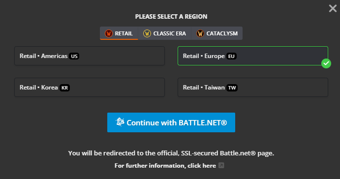
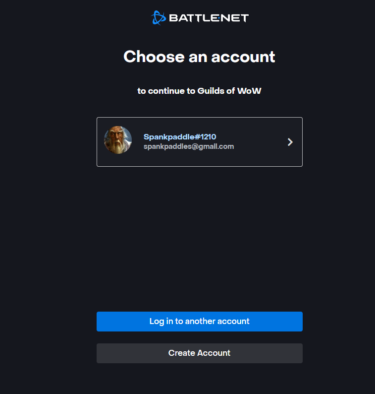
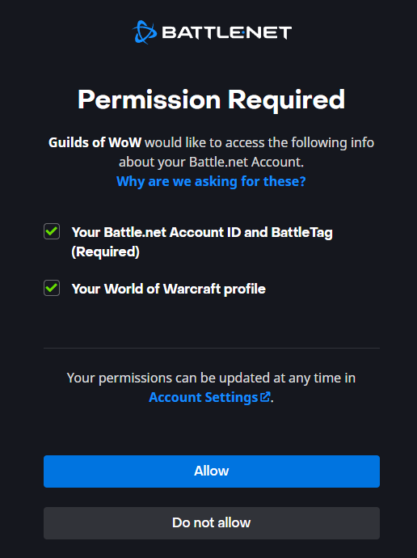
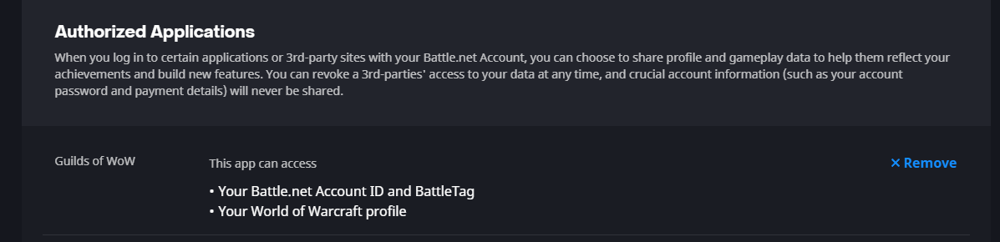
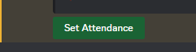

# Signing Up for a Discord Event

Index

* [Setup Guildsofwow.com Integrations](#Setup-Guildsofwow.com-Integrations)
    * [Guilds of Wow & Battlenet](#Guilds-of-Wow-&-Battlenet)
    * [Add Discord to Guilds of Wow](#Add-Discord-to-Guilds-of-Wow)
    * [Removing SSO integrations](#Removing-SSO-integrations)
        * [Remove Guilds of Wow from Battlenet](#Remove-Guilds-of-Wow-from-Battlenet)
        * [Remove Discord from Guilds of Wow](#Remove-Discord-from-Guilds-of-Wow)
* [Signing up for a new Event](#Signing-up-for-a-new-Event)
* [Removing/Updating yourself in a Raid Event](#Removing/Updating-yourself-in-a-Raid-Event)

## Setup Guildsofwow.com Integrations
Without cracking open what web integrations are and how SSO connections function. I'll try and break down what this is, why its needed and hopefully shed some light on this whole aspect of things.

* Battlenet - Has all your wow character information, on some websites like wowhead and raider.io, you can integrate SSO. Basically meaning you can use your battlenet login details for these websites reducing account/password bloat.
* Discord - Messaging platform and common forum the guild uses to communicate and coordinate events
* Guilds of wow (GOW) - An HR style website that allows you to manage your guild, recruitment, members and calendar events to list a few features.

What is this integration then? Well, in order for GOW to know who your characters are, and if those characters are in a guild. You give GOW limited access to character details for wow on your battlenet account. If you go to Guilds of wow you can see all your characters, their specs, and other information (similar to the armory).

So, when an event is posted to an events channel, you go to sign up for it. How does Discord or the GOW event know that my character Maxxiss belongs to my discord account? Well you need to do the same style of integration between GOW and discord. In essence you are telling GOW who your discord user is. Since you integrated your battlenet as well. GOW knows which characters belong to which discord account. 

Hopefully, with that nutshell breakdown of what is happening. You are a bit more confident in allowing these links to happen. As well as a basic understanding at a technical level what moving parts are required to make this happen.

### Guilds of Wow & Battlenet
First and foremost. You might actually need a Guilds of Wow account. You're just in luck as well, because when you sign up for an account on Guilds of Wow you do so directly through your battlenet account.

1) Head over to [https://guildsofwow.com/]()
2) In the top right, click "Sign up"
3) For the sake of the Guild, we are "retail - Europe". So select these option and click "Continue with battle.net"

4) You should now be redirected to the Battle.net Oauth page. Here you log into the battle.net account you wish to link and select it.

5) The next page are the "scope" details. In essence, what guilds of wow is asking access too. Click "Allow"

### Add Discord to Guilds of Wow
1) Log into guildsofwow.com
2) Go to https://guildsofwow.com/settings/connections

3) In "Connect your Accounts" click the Discord Icon

4) You should be redirected to a discord oauth2 page that shows you the "scope" that this integration has access to. You can then click "Authorize"

Just as a bit more of an explanation. Guilds of Wow is only asking for access to see your "Username, avatar and profile banner" for this integration. To me, this is pretty safe in terms of "What can Guilds of WOW access on my discord?". This means they don't see I have nitro, which servers im on, or my personal email or name. The Oauth2 scope is absolute, and this is a discord webpage telling YOU what GOW is asking for.

5) You should now be connected

6) Guilds of Wow will need to request the information from Battle.net at some point. Usually just navigating any page in GOW that contains character details will kick this off for you. 

### Removing SSO integrations
What if you leave us and no longer need or want the integration? Well, good practice is to remove access to your account that is no longer needed.

#### Remove Guilds of Wow from Battlenet
1) Log into battle.net with your details
2) Battlenet has made this process easy to do and get to. https://account.battle.net/connections
3) Remove Authorized Application by clicking the "x Remove" link

#### Remove Discord from Guilds of Wow
1) Log into guildsofwow.com
2) GOW has made this process easy to do and find. https://guildsofwow.com/settings/connections
3) Click the "Remove" link 

## Signing up for a new Event

Depending on the event type, the event could be posted in #events or #-raid-signup. Just check which channels you have access too and which events you want to attend as this guide should cover any channels posted event.

For the sake of this walk-through I'll be signing up for a raid on my main

1) Find your event

This looks fun! I think I'll sign up to be a healer for this event.

2) Set your attendance by clicking the "Set Attendance" box. This will create a chat reply in the same channel the event is posted in. Only you can see this message.

3) Select your attendance, character and spec in the new chat dialog

Since there is a connection between Discord, Battle.net and Guildsofwow.com this chat box will be populated with your character details. Once you have finished selecting everything, you can click save.

4) After clicking save, two things will have happened. First, the event will be updated with your attendance. 

Second, the channel the event is posted in should have a new message with your character's attendance details. Be aware that after a while, this message will go away and if you would like to adjust your attendance or change characters you will have to follow the next process for updating character specific information for an event.

# Removing/Updating yourself in a Raid Event

When you sign up for an event the last message you will receive is the character attendance message that lets you update the status or set notes. However, after a certain amount of time, this message gets purged from the events channel and you will have to go through the following to update attendance or change characters.

1) If the Character Attendance message is gone. You can generate it again by selecting the event you have already "Set Attendance" for. Just click "Set Attendance" again. This time, the signup message will have "New Attendance" or "Character-name * Attending"

2) Just like the initial event signup message, you can modify you attendance now.

3) The tool still requires you to select a spec

4) Click "Save" to set your new attendance.

5) **OPTIONAL** If you are swapping characters, you will have to repeat the above steps 1-4 for that new character.