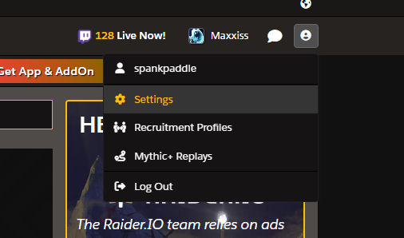
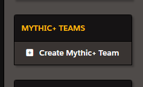
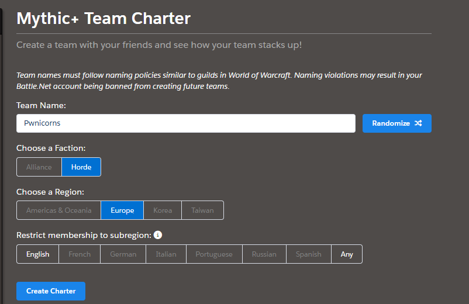
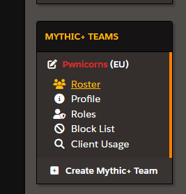
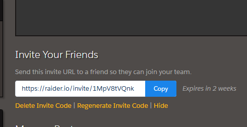

# Creating a Raider.io M+ Team

There is pretty much 1 prerequisite to this before you can create your Mythic Plus team. You need to have a raider.io account to begin with. Creating a raider.io account and linking it to your characters and stuff is out of the scope of this document.

## Creating your Team

1) Log into Raider.io
2) Click on your profile settings

   
3) On the left hand menu, towards the bottom you should see the option "Mythic+ Teams"

4) Fill in the form with all the required details.

5) Click 'Create Charter"

6) Before you can finalize the creation of this team you will have to add members which is covered by the next section.

Congrats!!!! You have now created a Mythic Plus team that Raider.io is aware of. Now you need to start adding your team and team members.

## Adding to your team
In the last step we walked through how to create a mythic plus team on the raider.io platform. Now we need to go through the process of actually inviting members to this team.

1) Head over to Raider.io and log into your profile and go to the settings like you did when creating your team.

2) Find the team you want to add members to and click the "Roster" link

3) On the team page, towards the bottom you should see a "Invite Your Friends" section with a box you can click called "Create Invite Code". Click the box

4) You can share this link with your friends that have a Raider.io account 

Congrats! You now have a team and a roster making up members of this team. Don't forget to click "Create Mythic+ team" button at the top or bottom of the page to finalize everything.

Now all you need to do is open the raider.io application from time to time to sync the data after your runs. Enjoy!